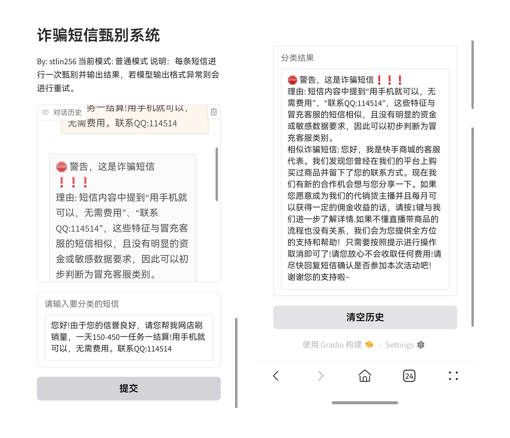
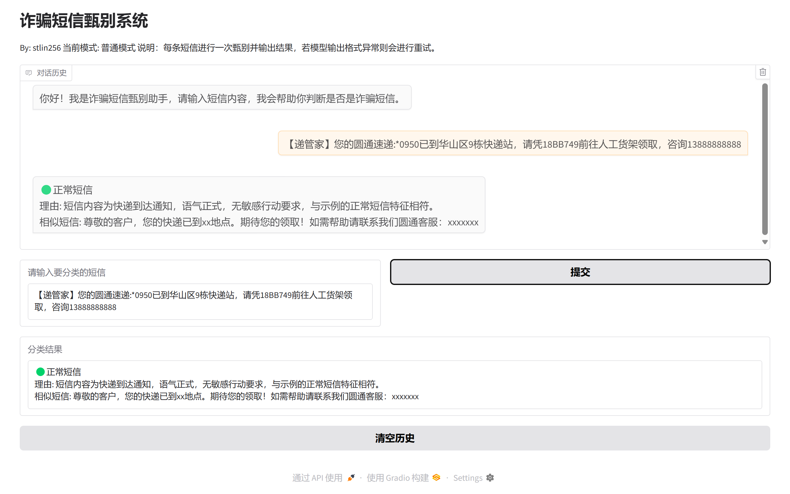
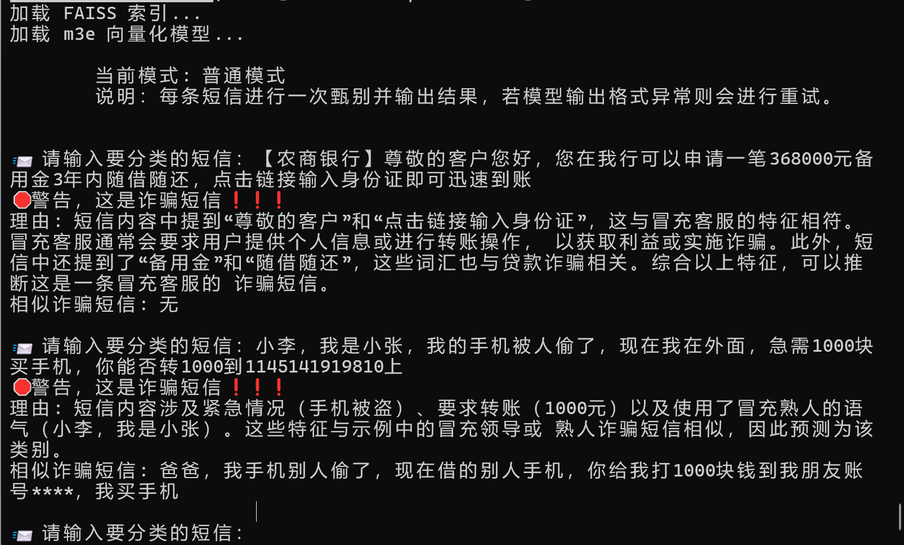
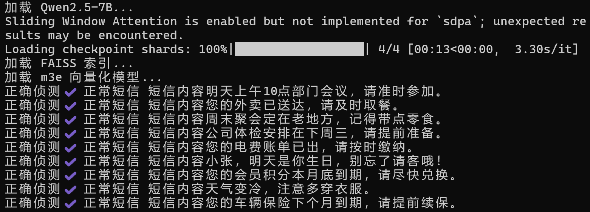
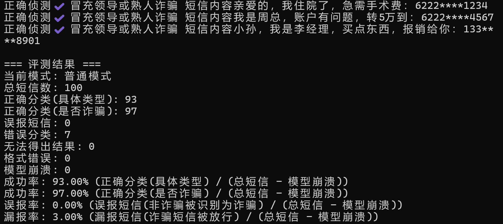

## FraudSMS_RAG_Shield

# 融合大模型推理与RAG检索增强的诈骗短信甄别系统

### 简介

本项目结合大模型推理与 **RAG（检索增强生成）** 技术，致力于对短信进行精准识别和分类，保护用户免受电信诈骗侵害。系统基于 [Telecom_Fraud_Texts_5](https://github.com/ChangMianRen/Telecom_Fraud_Texts_5) 数据集，采用 [m3e-base](https://huggingface.co/moka-ai/m3e-base) 模型对短信进行向量化，利用 [FAISS](https://github.com/facebookresearch/faiss) 实现快速相似性检索，并结合 [Qwen2.5-7B](https://huggingface.co/Qwen/Qwen2.5-7B) 大模型进行深度推理。系统能够识别 **“正常短信”** 及以下四类诈骗类型：

- **冒充公检法**（假装执法机构，恐吓或索要信息）
- **贷款诈骗**（涉及贷款、优惠条件诱导转账）
- **冒充客服**（假冒服务人员索要信息或钱财）
- **冒充领导或熟人诈骗**（假装熟人或上级要求转账）

通过提供分类结果、理由和相似短信示例，系统不仅提升分类准确性，还增强了结果的可解释性，帮助用户有效防范诈骗短信。

------

### 主要特性

- **高准确性**：诈骗短信漏报率仅 **3%**（基于 benchmark.py 测试结果）。
- **快速响应**：在 NVIDIA 4060 Laptop 上，平均 **3秒** 内得出结果。
- **可解释性强**：输出分类结果、理由及相似短信示例，帮助用户理解判断依据。
- **用户友好**：通过 [Gradio](https://gradio.app/) 提供可视化 Web 界面，便于交互。
- **创新结合**：结合 RAG 技术和大模型推理，提升分类准确性和推理深度。

------

### 效果展示

#### run_webui.py

手机浏览器界面：

电脑浏览器界面：


#### run_shell.py


#### benchmark.py

<center>省略中间内容</center>



------

### 硬件要求

- **最低配置**：配备 **8GB 显存** 的 NVIDIA GPU（支持 CUDA）。

------

### 安装与配置

1. 安装 Anaconda

- 下载并安装 Anaconda：[Anaconda.org](https://www.anaconda.com/)
- 安装完成后，打开 **Anaconda Prompt**。
- 创建虚拟环境


```
conda create -n sms python=3.12
```

2. 激活环境：

```bash
conda activate sms
```

3. 安装依赖

进入项目根目录，安装所需 Python 包：

```bash
pip install -r requirements.txt
```

安装pytorch（根据自身配置前往[pytorch.org](https://pytorch.org/)获取下载链接）
```bash
pip3 install torch torchvision torchaudio --index-url https://download.pytorch.org/whl/cu126
```

安装 FAISS（GPU 版本）：

```bash
conda install -c conda-forge faiss-gpu
```

4. 下载模型和数据集

- **模型下载**：
  - [Qwen2.5-7B](https://huggingface.co/Qwen/Qwen2.5-7B)
  - [m3e-base](https://huggingface.co/moka-ai/m3e-base)
  - 如果无法访问 Hugging Face，可使用镜像：
    - [Qwen2.5-7B (HF Mirror)](https://hf-mirror.com/Qwen/Qwen2.5-7B)
    - [m3e-base (HF Mirror)](https://hf-mirror.com/moka-ai/m3e-base)
- **数据集下载（可选）**：
  - [Telecom_Fraud_Texts_5](https://github.com/ChangMianRen/Telecom_Fraud_Texts_5)
  - **注意**：项目已附带向量化数据集（fraud_sms_faiss.index 和 fraud_sms_metadata.json），推理时无需下载原始数据集。

### 文件结构

确保项目目录结构如下：

```plaintext
项目目录
│   benchmark.py
│   fraud_sms_dataset.json
│   fraud_sms_faiss.index
│   fraud_sms_metadata.json
│   generate_data.py
│   run_shell.py
│   run_webui.py
│   requirements.txt
│
├───m3e-base
│   │   config.json
│   │   model.safetensors
│   │   tokenizer.json
│   │   (其他模型文件)
│   └───1_Pooling
│           config.json
│
├───Qwen2.5-7B
│       config.json
│       model-00001-of-00004.safetensors
│       model-00002-of-00004.safetensors
│       model-00003-of-00004.safetensors
│       model-00004-of-00004.safetensors
│       tokenizer.json
│       (省略其他模型文件)
│
└───Telecom_Fraud_Texts_5-main (可选)
        label00-last.csv
        label01-last.csv
        label02-last.csv
        label03-last.csv
        label04-last.csv
        LICENSE
        README.md
```

------

### 运行项目

#### 1. Web交互

```bash
python run_webui.py
```

- 等待模型加载完成，终端将输出一个 URL（ 默认 http://127.0.0.1:7860 ）。
- 在浏览器中打开该链接，即可进入交互界面。

#### 2. 命令行交互
```bash
python run_shell.py
```
- 模型加载完成后，可在终端输入短信内容进行分类。


#### 3. 基准测试
```bash
python benchmark.py
```
- 将自动加载 fraud_sms_dataset.json 中的测试数据，运行评估并输出结果。

#### 4. 生成数据库（可选）
```bash
python generate_data.py
```
- 读取分类短信数据并生成数据库（注：项目仓库内已包含生成的数据库）

------

### 代码配置

以下参数可在 run_webui.py、run_shell.py 或 benchmark.py 中调整：

- **LLM_PATH = "./Qwen2.5-7B"**
  大模型路径。
- **M3E_PATH = "./m3e-base"**
  向量化模型路径（需与生成索引时使用的模型一致）。
- **FAISS_INDEX_FILE = "fraud_sms_faiss.index"**
  FAISS 索引文件路径。
- **METADATA_FILE = "fraud_sms_metadata.json"**
  元数据文件路径。
- **SAFE_MODE = False**  
  - True：稳妥模式（三次预测取多数）。
  - False：普通模式（单次预测）。
  - **注意**：当前提示词和超参数下，两者表现差异不大。
- **DE_BUG = False**
  是否显示模型原始输出（调试用）。
- **SHOW_CATEGORY = False**
  是否显示分类类别。
- **SHOW_SAMPLE = True**
  是否显示相似短信示例。
- **MAX_TOKENS = 1024**
  模型最大输出长度。
- **MAX_RETRIES = 2**
  输出异常时的最大重试次数。

------


### 基准测试结果

以下为系统在普通模式下的测试结果（ benchmark.py）：

```plaintext
=== 评测结果 ===
当前模式: 普通模式
总短信数: 100
正确分类(具体类型): 93
正确分类(是否诈骗): 97
误报短信: 0
错误分类: 7
无法得出结果: 0
格式错误: 0
模型崩溃: 0
成功率: 93.00% (正确分类(具体类型) / (总短信 - 模型崩溃))
成功率: 97.00% (正确分类(是否诈骗) / (总短信 - 模型崩溃))
误报率: 0.00% (误报短信(非诈骗被识别为诈骗) / (总短信 - 模型崩溃))
漏报率: 3.00% (漏报短信(诈骗短信被放行) / (总短信 - 模型崩溃))
```

------

### 许可证

本项目采用GPLv3许可证。详情请参阅 [LICENSE](LICENSE)文件。

------
### 本项目使用的数据集 [Telecom_Fraud_Texts_5](https://github.com/ChangMianRen/Telecom_Fraud_Texts_5) 具有使用限制

**使用限制**：

- 该数据集仅限 **高校和科研机构** 用于科学研究。

- **禁止** 用于任何商业目的，不提供商业授权。

- 使用数据集进行科学研究并发表成果时，需注明来源，例如：

  Li, J.; Zhang, C.; Jiang, L. Innovative Telecom Fraud Detection: A New Dataset and an Advanced Model with RoBERTa and Dual Loss Functions. *Appl. Sci.* 2024, **14**, 11628. https://doi.org/10.3390/app142411628

------


### 联系方式

- **GitHub**：[stlin256](https://github.com/stlin256)
- 欢迎提交问题或建议！

------


### 致谢

- 感谢 [ChangMianRen](https://github.com/ChangMianRen) 提供数据集 [Telecom_Fraud_Texts_5](https://github.com/ChangMianRen/Telecom_Fraud_Texts_5)。
- 感谢 [Qwen](https://huggingface.co/Qwen) 和 [moka-ai](https://huggingface.co/moka-ai) 提供的优质模型。

------
